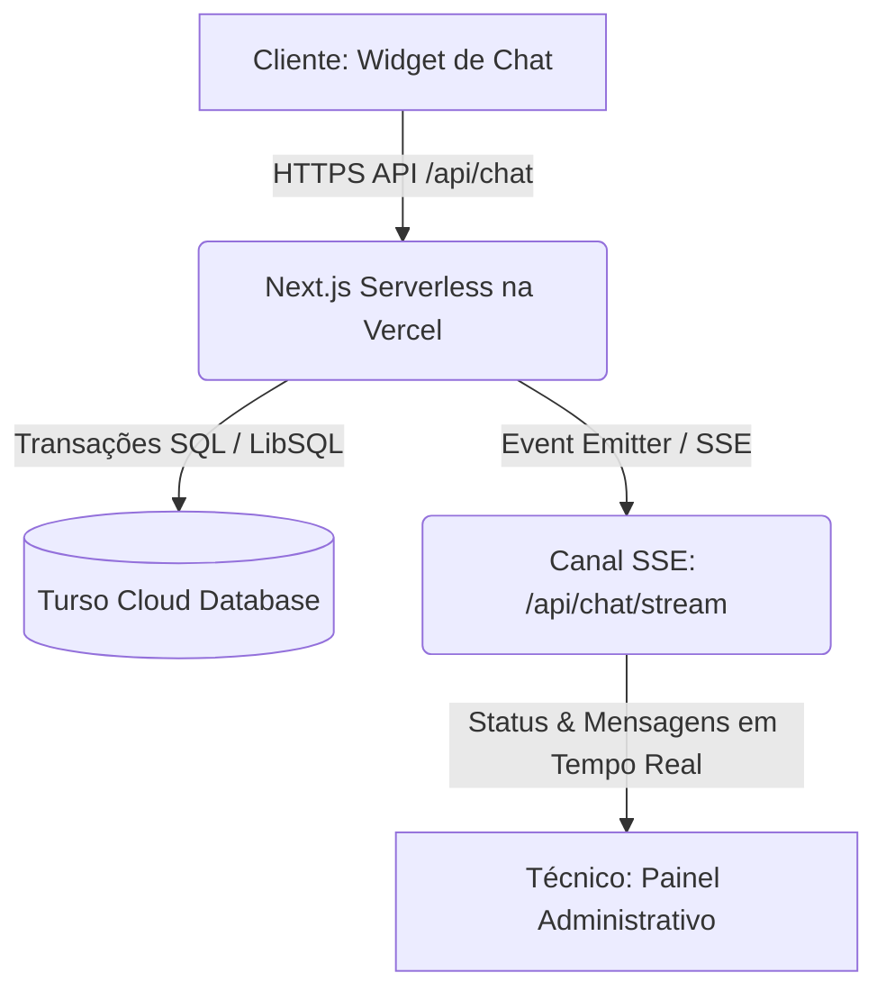

# 📖 Especificação Técnica de Design (v1.0) — LibertyBot

Este documento serve como a especificação de design oficial e durável para a versão de produção **v1.0** do ecossistema do **LibertyBot**.

---

## 🧠 1. Resumo do Entendimento
*   **O que está sendo construído:** Um sistema corporativo completo de suporte inteligente N1 integrado a um painel de atendimento humano N2, com compartilhamento de tela remoto via WebRTC e gerenciamento de conhecimento.
*   **Por que existe:** Para automatizar a resolução de incidentes comuns na equipe de TI da **Liberty Health** utilizando dados do Confluence, oferecendo transição transparente para técnicos humanos quando o chatbot não souber responder.
*   **Público-Alvo:** Técnicos de suporte da Liberty TI (atendentes) e colaboradores das unidades de saúde da Liberty Health (solicitantes).
*   **Volumetria e Escala:** Projetado para suportar até **10.000 chamados por mês** espalhados por **200 unidades distintas**, com concorrência estimada de até 50 usuários simultâneos e 20 técnicos ativos.

---

## ⚙️ 2. Premissas de Projeto (Assumptions)
*   **Hospedagem de Custo Zero:** O Next.js será hospedado gratuitamente na **Vercel (Hobby Tier)**, e o banco de dados SQLite será executado de forma distribuída e persistente na nuvem através do **Turso (Free Tier)**.
*   **Criptografia na Aplicação:** A criptografia para conformidade com a LGPD será gerenciada na camada do backend da aplicação Next.js utilizando chaves privadas salvas nas variáveis de ambiente.
*   **Servidor TURN:** O tráfego de compartilhamento de tela que falhar em conexões diretas P2P será roteado por servidores TURN comerciais (ex: Twilio Network Traversal), configurados dinamicamente sob demanda.

---

## 📓 3. Registro de Decisões (Decision Log)
1.  **Estilo e Identidade:** Utilização exclusiva de **Tema Claro (Light Theme)** corporativo de alto contraste com tons de azul e branco institucionais da Liberty Health para manter conformidade visual de marca.
2.  **Infraestrutura Vercel + Turso:** Escolhido em substituição ao SQLite local puro para viabilizar deploy serverless 100% gratuito sem perda de dados (já que o sistema de arquivos da Vercel é efêmero).
3.  **Conformidade com a LGPD (Opção A):** Armazenamento criptografado (AES-256-GCM), termos de aceite pré-chat e ferramenta de anonimização total (*Direito ao Esquecimento*) acionável pelo técnico.
4.  **WebRTC com TURN Server:** Escolhida a integração dinâmica com servidores TURN comerciais para garantir conexão em redes hospitalares restritivas.
5.  **Resumo de Escala com IA:** Geração automática e envio de um sumário da conversa inicial com o bot ao técnico no momento em que o atendimento é transferido, economizando tempo do operador.
6.  **Seletor Autocomplete:** Campo de busca inteligente para unidades no pré-chat, viabilizando a navegação rápida entre 200 filiais diferentes.

---

## 🛠️ 4. Especificações de Design (v1.0)

### 📐 Seção 1: Arquitetura & Banco de Dados (Prisma + Turso)
O banco de dados utilizará o dialeto **LibSQL** na plataforma Turso, mantendo o esquema gerenciado via Prisma Client. A conexão do Prisma será ajustada para otimizar conexões serverless através de pooling e ativando o modo **WAL (Write-Ahead Logging)** com `busy_timeout=5000` para concorrência segura de escrita.

#### Criptografia de Dados (LGPD):
Para dados pessoais armazenados (`userName`, `userCpf`, `userEmail`) e conteúdo de mensagens (`content`), utilizaremos criptografia simétrica instruída no backend usando o algoritmo `aes-256-gcm` com uma chave privada `ENCRYPTION_KEY` de 32 bytes definida nas variáveis de ambiente.

---

### 📐 Seção 2: Autenticação de Técnicos, SLA & Fila de Atendimento
*   **Gestão de Técnicos:** Acesso restrito ao painel de controle por login individual. As senhas de usuários na tabela `User` são salvas após criptografia via `bcrypt` (10 rounds de salt).
*   **Cálculo de SLA:** O painel administrativo monitorará a propriedade `statusChangedAt` das conversas em estado `WAITING` para sinalizar visualmente com alerta piscante em vermelho chamados que excederem o tempo máximo de **5 minutos** em fila de espera.
*   **Alertas Sonoros:** Utilizando a API `Audio` nativa do HTML5 no navegador do atendente, um sinal sonoro leve (sino) será acionado a cada chegada de sinal SSE indicando um novo ticket pendente na fila.

---

### 📐 Seção 3: Resiliência WebRTC & Autocomplete de Unidades
*   **Roteamento TURN:** O backend consumirá a API de serviços de rede (como Twilio Network Traversal) para gerar credenciais dinâmicas do WebRTC com expiração curta. Ao inicializar o compartilhamento de tela, o cliente e o técnico obtêm as configurações atualizadas de `iceServers` via `/api/chat/webrtc/token`.
*   **Fila de Candidatos ICE:** Ambos os lados implementam uma fila de candidatos. Se o sinal de candidato ICE chegar antes que a descrição de SDP (`offer` ou `answer`) esteja definida, o sinal é armazenado e executado imediatamente após o sucesso de `setRemoteDescription()`.
*   **Autocomplete de Unidades:** Um banco de dados estático em JSON (`units.json`) fornecerá as 200 opções de filiais de saúde da Liberty Health. O formulário inicial usará um componente de input com filtro de autocompletar na memória do cliente.

---

### 📐 Seção 4: Gaps de Conhecimento & Fluxo de Esquecimento LGPD
*   **Gestão de Gaps (Analytics):** O painel do administrador consolidará a contagem de perguntas da tabela `UnansweredQuestion`. O fluxo permitirá que o administrador adicione as respostas faltantes diretamente à base de conhecimento indexada pelo bot, melhorando a acurácia continuamente.
*   **Termos de Aceite:** O widget forçará a seleção de consentimento antes de permitir o envio do formulário de pré-cadastro.
*   **Direito ao Esquecimento:** A ferramenta de anonimização no painel do técnico executa uma transação de banco de dados que:
    1.  Substitui os dados cadastrais da conversa (`userName`, `userCpf`, `userEmail`) por valores fixos `[ANONIMIZADO]`.
    2.  Deleta fisicamente todas as mensagens de chat e arquivos associados à conversa.
    3.  Preserva apenas o ID da unidade e os registros de horário de início e fim para manter relatórios consolidados e corretos na auditoria da TI.
