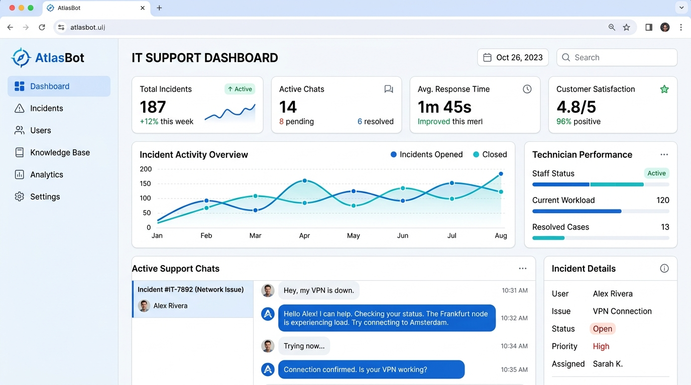

# 🚀 AtlasBot — Plataforma Inteligente de Atendimento N1/N2 & Suporte Remoto



---

## 📑 Visão Geral

O **AtlasBot** é uma plataforma corporativa de suporte de TI inteligente e atendimento humano de segundo nível, projetada especificamente para o ecossistema da **Liberty Health**. 

O sistema automatiza o atendimento de primeiro nível (N1) consultando a base de conhecimento interna (sincronizada via Confluence e PDFs) usando IA generativa com RAG. Caso o usuário precise de auxílio avançado, o chat é escalado de forma transparente para um técnico humano (N2), com suporte a **compartilhamento de tela em tempo real direto no navegador via WebRTC**, sem necessidade de instalação de softwares de terceiros.

Tudo isso rodando em um **Tema Claro (Light Theme)** corporativo premium, com conformidade total com a **LGPD (Lei Geral de Proteção de Dados)** e arquitetado para ser hospedado **100% gratuitamente** usando **Vercel** e **Turso Cloud (SQLite)**.

---

## ⚡ Badges & Tecnologias

[](https://nextjs.org/)
[](https://react.dev/)
[](https://prisma.io/)
[](https://tailwindcss.com/)
[](https://turso.tech/)
[](https://webrtc.org/)
[](#-conformidade-com-a-lgpd)
[](LICENSE)

---

## 💎 Funcionalidades Principais (Features)

*   **🧠 Assistente Inteligente N1 (RAG Híbrido):** Processa perguntas e formula respostas baseadas em base de conhecimento alimentada por Confluence API (sincronização de espaços) e uploads locais de arquivos (PDF, DOCX, TXT, MD).
*   **📋 Cadastro de Pré-Chat com Autocomplete:** Formulário inicial solicitando *Nome, CPF, E-mail e Unidade*. O seletor de Unidades é um Autocomplete inteligente que filtra de forma fluida entre **200 unidades diferentes**.
*   **📞 Escalonamento N1 -> N2 Sem Atrito:** Transição rápida para suporte humano com controle de estado (`BOT`, `WAITING`, `ACTIVE`, `CLOSED`) em tempo real alimentado por Server-Sent Events (SSE).
*   **📝 Resumo de Contexto por IA:** Ao transferir o chamado para a fila, a IA gera automaticamente um resumo executivo em tópicos da conversa com o bot e insere no histórico para o técnico ler instantaneamente.
*   **🖥️ Espelhamento de Tela (WebRTC + TURN):** Permite ao técnico ver a tela do solicitante em tempo real no navegador. Inclui **servidor TURN configurado dinamicamente** para transpor firewalls hospitalares rígidos e fila de candidatos ICE para evitar falhas de conexão.
*   **⏰ SLA & Alertas Sonoros/Visuais:** O painel administrativo sinaliza visualmente em vermelho chamados que excederem o tempo limite de **5 minutos** na fila de espera. Emite um som de alerta sonoro suave a cada novo ticket na fila.
*   **📊 Analytics de Gaps de Conhecimento:** Consolida perguntas frequentes que o bot não conseguiu responder, permitindo ao administrador alimentar a base diretamente do dashboard com um clique.
*   **🛡️ Conformidade com a LGPD:** Termos de consentimento explícitos, criptografia simétrica local (AES-256-GCM) para dados cadastrais e histórico de mensagens, e botão **"Excluir Dados (LGPD)"** para anonimização total e exclusão sob demanda (*Direito ao Esquecimento*).

---

## 📁 Estrutura do Projeto

```text
├── prisma/
│   └── schema.prisma        # Modelos de banco de dados (Conversas, Mensagens, Gaps, Users)
├── public/
│   ├── mockup.jpg           # Imagem conceitual de demonstração do sistema
│   └── widget.js            # Script compilado do widget para embutir em outros sites
├── src/
│   ├── app/
│   │   ├── api/             # Endpoints HTTP (Auth, Chat, SSE Stream, WebRTC, Confluence)
│   │   ├── dashboard/       # Painel administrativo de chamados e estatísticas de uso
│   │   ├── knowledge/       # Área de upload e sincronização de base do Confluence
│   │   ├── settings/        # Configurações do chatbot e cores da marca
│   │   └── widget/          # Playground demo do widget flutuante de atendimento
│   ├── components/          # Componentes reutilizáveis (AppShell, ChatInput, MessageBubble)
│   ├── hooks/               # React Hooks customizados (useChatStream para SSE)
│   └── lib/                 # Utilitários auxiliares (AI Chain, Conexão Prisma, Criptografia)
```

---

## 🚀 Como Executar Localmente

### 1. Pré-requisitos
*   Node.js (versão 20.9.0 ou superior)
*   Conta no Turso (opcional para local, padrão SQLite local `dev.db` pode ser usado)

### 2. Clonar o repositório
```bash
git clone https://github.com/BrunoSouzaFarias/AtlasBot.git
cd AtlasBot
```

### 3. Instalar Dependências
```bash
npm install
```

### 4. Configurar as Variáveis de Ambiente
Crie um arquivo `.env` (ou `.env.local`) na raiz do projeto com o seguinte conteúdo:
```env
# Banco de dados (para local, pode usar SQLite local)
DATABASE_URL="file:./dev.db"

# API Key da OpenAI / NVIDIA AI Foundation (DeepSeek)
OPENAI_API_KEY="sua-chave-api-aqui"

# Chave simétrica de criptografia LGPD (Gerar 32 bytes em hexadecimal)
# Ex: node -e "console.log(require('crypto').randomBytes(32).toString('hex'))"
ENCRYPTION_KEY="sua-chave-de-criptografia-32-bytes"

# Configurações do Confluence (Opcional, preencha para habilitar sincronização)
CONFLUENCE_DOMAIN="sua-empresa.atlassian.net"
CONFLUENCE_EMAIL="seu-email-atlassian@empresa.com"
CONFLUENCE_API_TOKEN="seu-token-api-confluence"

# Twilio TURN Server (Opcional, para resiliência de firewall)
TWILIO_ACCOUNT_SID="seu-account-sid"
TWILIO_AUTH_TOKEN="seu-auth-token"
```

### 5. Executar Migrações do Banco de Dados
Sincronize a estrutura do Prisma com o seu banco local:
```bash
npx prisma db push
```

### 6. Rodar o Servidor de Desenvolvimento
```bash
npm run dev
```
O servidor estará disponível em: `http://localhost:3000`

---

## ☁️ Instruções de Deploy (Vercel + Turso)

Para colocar a aplicação em produção gratuitamente em menos de 10 minutos:

### 1. Criar o Banco de Dados no Turso
1. Acesse [Turso.tech](https://turso.tech) e crie uma conta gratuita.
2. Instale o CLI do Turso ou use o Console Web para criar um banco de dados:
   ```bash
   turso db create atlasbot-db
   ```
3. Obtenha a URL de conexão e o Token de autenticação:
   ```bash
   turso db show atlasbot-db --show-urls
   turso db tokens create atlasbot-db
   ```
4. Formate a variável `DATABASE_URL` para o Prisma usar LibSQL:
   `libsql://atlasbot-db-username.turso.io?authToken=seu-auth-token`

### 2. Deploy na Vercel
1. Crie uma conta na [Vercel](https://vercel.com/) e conecte sua conta do GitHub.
2. Importe o repositório `AtlasBot`.
3. Em **Environment Variables**, adicione todas as variáveis configuradas no seu `.env` local (utilizando a URL de conexão LibSQL do Turso como `DATABASE_URL`).
4. Clique em **Deploy**. A Vercel executará o script `vercel-build` (gerando as tabelas no Turso e compilando a aplicação).

---

## 🛡️ Conformidade com a LGPD

O **AtlasBot** protege os dados dos colaboradores seguindo as diretrizes da LGPD:

1.  **Criptografia AES-256-GCM:** Nomes, CPFs, e-mails e as mensagens trocadas são criptografados antes de serem salvos no disco, evitando vazamentos mesmo se o arquivo do banco for exposto.
2.  **Direito ao Esquecimento:** Operadores autorizados podem limpar os dados pessoais de qualquer conversa finalizada com um clique no painel. O sistema apaga as mensagens e limpa os campos pessoais, mantendo apenas informações anônimas de tempo de fila e unidade para fins de estatísticas de nível de serviço (SLA).

---

## 📄 Licença

Este projeto está sob a licença MIT. Consulte o arquivo [LICENSE](LICENSE) para obter mais informações.
